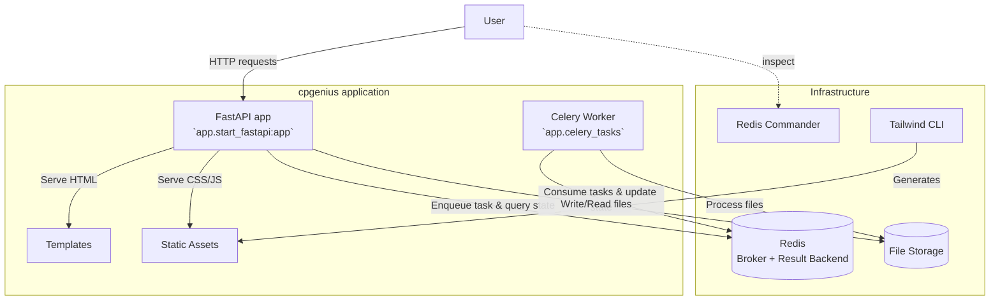
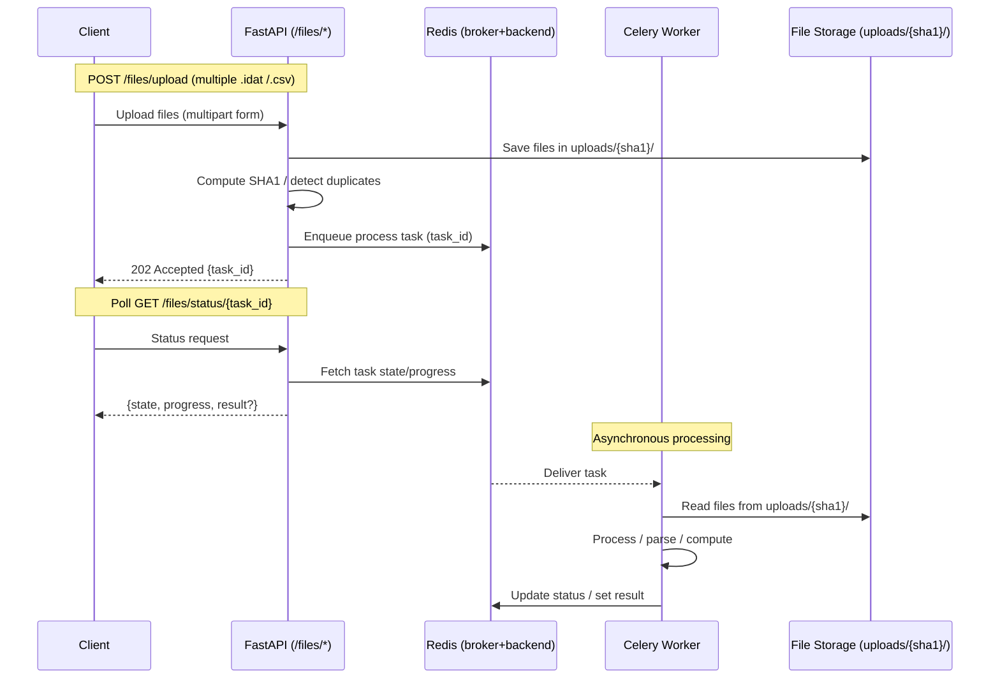
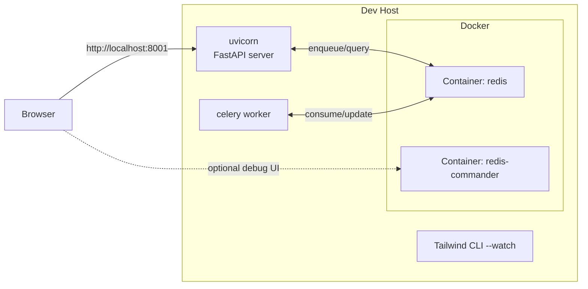
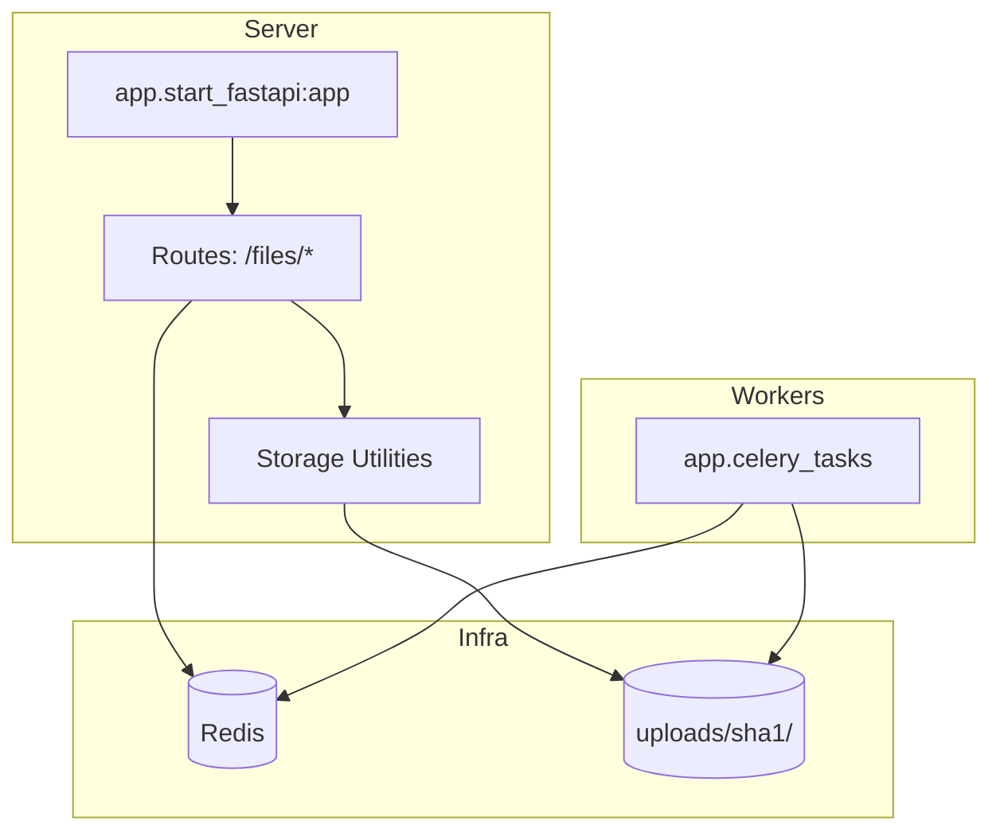
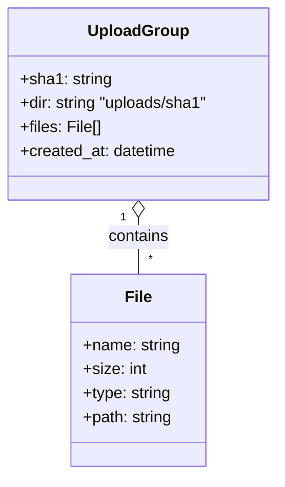

# CpGenius – Architecture Diagrams

This document provides ready-to-embed Mermaid diagrams for CpGenius. Paste this file into `docs/architecture.md` in your repo to render on GitHub.

## 1) System Overview

## 2) Request–Task Flow (Upload & Progress)

## 3) File Management Endpoints (Happy Paths)

```mermaid
sequenceDiagram
  participant C as Client
  participant A as FastAPI
  participant S as File Storage

  rect rgb(50,50,60)
  Note over C,A: List files
  C->>A: GET /files/list
  A->>S: Scan uploads/*
  A-->>C: [{sha1, filenames, sizes, mtime...}]
  end

  rect rgb(30,50,60)
  Note over C,A: Remove by SHA1
  C->>A: DELETE /files/remove/sha1
  A->>S: Delete directory uploads/sha1/
  A-->>C: {ok:true}
  end
```

## 4) Deployment (Local Dev)

## 5) Module Interaction (Minimal)

## 6) Data Organization

