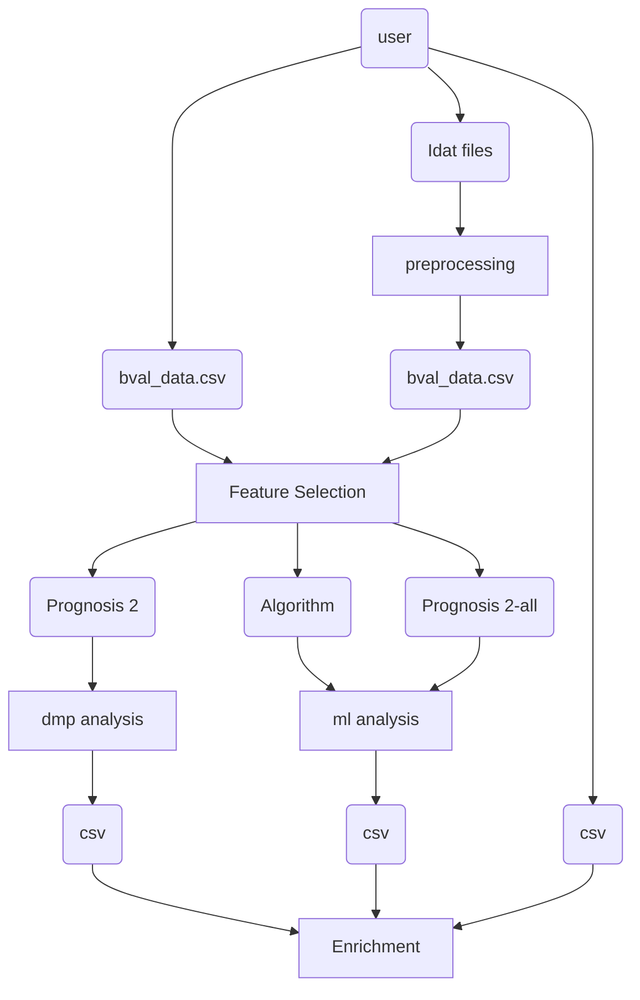
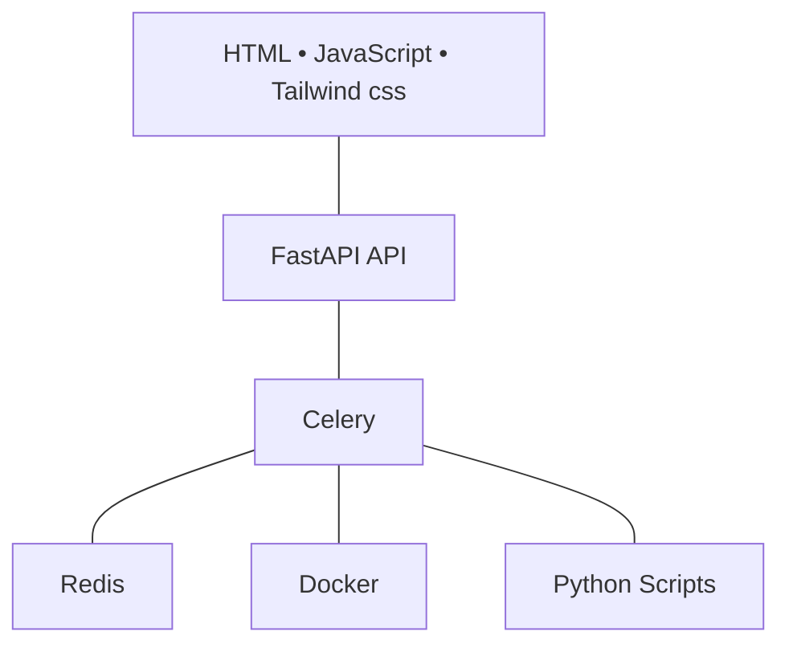
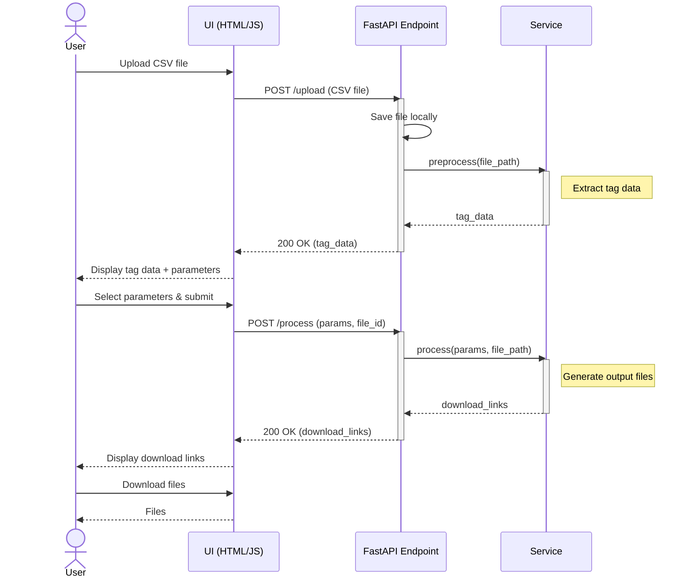

# Application Architecture

## System Architecture

<div style="text-align: justify;">

CpGene is a DNA Methylation Analysis Platform built with a modern microservices architecture using FastAPI, Celery, Redis, and Docker. The system processes IDAT files (Illumina methylation arrays) and CSV data to perform comprehensive feature selection and machine learning analysis.

</div>

## Architecture Components

### 1. Frontend Layer

- **Technology**: HTML5, JavaScript, Tailwind CSS
- **Main Files**:
  - `templates/bval.html` - Primary interface for IDAT file upload
  - `templates/index.html` - Landing page
  - `static/bval.js` - Interactive functionality, image galleries, download management
  - `static/*.css` - Styling and responsive design

**Features**:

- Drag-and-drop file upload with SHA-1 hashing
- Real-time image gallery with click-to-enlarge modals
- Responsive design with emerald neon styling
- ZIP download functionality for analysis results

### 2. API Layer (FastAPI)

- **Framework**: FastAPI with Uvicorn ASGI server
- **Port**: 8001
- **Main File**: `app/start_fastapi.py`

**Router Modules**:

- `routers/html.py` - Template rendering endpoints
- `routers/file_upload.py` - File upload and management
- `routers/prognosis_analysis.py` - Analysis endpoints, image serving, ZIP downloads
- `routers/util.py` - Utility endpoints

**Key Endpoints**:

- `POST /idat/upload` - IDAT file bundle upload
- `GET /idat/exists/{id}` - Check if bundle exists
- `GET /prognosis/images/{sha1_hash}` - List generated PNG images
- `GET /prognosis/image/{sha1_hash}/{filename}` - Serve individual images
- `GET /prognosis/download-all/{sha1_hash}` - Download ZIP of all results

### 3. Task Processing Layer (Celery)

- **Message Broker**: Redis
- **Task Modules**:
  - `celery_tasks/file_tasks.py` - File processing operations
  - `celery_tasks/prognosis_tasks.py` - ML analysis tasks
  - `celery_tasks/celery.py` - Celery configuration

**Task Processing Features**:

- Asynchronous IDAT file processing
- CSV data analysis and feature selection
- PNG visualization generation
- JSON serialization handling for pandas DataFrames

### 4. Machine Learning Engine

- **Location**: `app/algorithms/`

#### Feature Selection Methods:

- **ANOVA F-Test** (`anova_ftest.py`) - Statistical significance testing
- **Random Forest Variable Importance** (`random_forest_varimp.py`) - Tree-based feature ranking
- **LASSO Logistic Regression** (`lasso_logistic_regression.py`) - L1 regularization
- **RFE SVM** (`rfe_svm.py`) - Recursive Feature Elimination with Support Vector Machines
- **Ridge L2** (`ridge_l2.py`) - L2 regularized linear models
- **SHAP XGBoost** (`shap_xgboost.py`) - Explainable AI feature importance
- **Garsen-Olden MLP** (`garsen_olden_mlp.py`) - Neural network with connection weights analysis

### 5. Containerized Processing (Docker)

- **R-MinFi Container**: Specialized container for IDAT file processing
- **Purpose**: Methylation array data preprocessing
- **Operations**:

  - Beta value calculation
  - Quality control metrics
  - Methylation signal extraction
  - Array type detection

- **R-DMP (limma) Container**: Specialized container for DMP analysis
- **Purpose**: Differentially Methylated Positions (DMP) analysis from methylation arrays using limma (supports covariates & contrasts).
- **Operations**:
  - β-value matrix ingestion with matched phenotype table
  - Category/contrast selection (e.g., A vs B or custom contrasts)
  - limma linear modeling with empirical Bayes
  - P-value and FDR (BH) computation
  - CpG filtering by |Δβ| and p/FDR thresholds

### 6. Data Storage

- **File Storage**: Local filesystem (`uploads/` directory)
- **Structure**: `uploads/{sha1_hash}/in/` and `uploads/{sha1_hash}/out/`
- **Input Files**: `.idat`, `.csv`
- **Output Files**: PNG visualizations, `array_type.csv`, `bval_data.csv`

### 7. Infrastructure Components

#### Redis (Message Broker)

- **Port**: 6379
- **Purpose**: Celery task queue and results backend
- **Docker**: Managed via `docker/docker-redis-commander/`

#### Package Management

- **Python**: `uv` (modern Python package manager)
- **Frontend**: `npm` for Tailwind CSS and build tools
- **Configuration**: `pyproject.toml`, `package.json`

## Data Flow

### 1. File Upload Process

```
User Browser → FastAPI → SHA-1 Calculation → File Storage → Celery Task Queue
```

### 2. Analysis Pipeline

```
Celery Worker → Docker R-MinFi → ML Algorithms → PNG Generation → Result Storage
```

### 3. Result Delivery

```
FastAPI Image Endpoints → Dynamic Gallery → User Download (Individual/ZIP)
```

## Security & Performance Features

### File Integrity

- **SHA-1 Hashing**: Ensures file integrity and prevents duplicate processing
- **Bundle Detection**: Automatic detection of existing analyses

### Scalability

- **Async Processing**: Non-blocking task execution
- **Worker Scaling**: Multiple Celery workers can be deployed
- **Resource Management**: Configurable task timeouts and memory limits

### User Experience

- **Real-time Feedback**: Progress indicators and status updates
- **Responsive Design**: Mobile-friendly interface
- **Batch Operations**: ZIP download of all analysis results

## Development Workflow

### Starting the System

```bash
# 1. Start Redis
cd docker/docker-redis-commander && docker compose up -d

# 2. Start Celery Worker
uv run celery -A app.celery_tasks worker -l INFO

# 3. Start FastAPI Server
uv run uvicorn app.start_fastapi:app --host 0.0.0.0 --port 8001 --reload
```

### Development Tools

- **Auto-reload**: FastAPI development server with hot reloading
- **Task Monitoring**: Redis Commander for queue inspection
- **API Documentation**: Automatic OpenAPI docs at `/docs`

## Integration Points

### External Dependencies

- **Scientific Libraries**: pandas, numpy, scikit-learn, xgboost
- **Web Framework**: FastAPI, Jinja2 templates
- **Task Queue**: Celery with Redis backend
- **Containerization**: Docker for R environment isolation

### Data Formats

- **Input**: Illumina IDAT files, CSV methylation data
- **Processing**: Pandas DataFrames, NumPy arrays
- **Output**: PNG visualizations, CSV results, ZIP archives

This architecture provides a robust, scalable platform for DNA methylation analysis with a modern web interface and powerful machine learning capabilities.

<div align="center">



</div>

<br>

<div style="text-align: justify;">

User-provided IDAT files undergo preprocessing and quality control to produce normalized beta values, which are exported as processed datasets. These data are then subjected to feature selection using either differential methylation point analysis or machine learning–based ranking in binary or multi-class settings. Each analytical path generates CpG sets that are saved in CSV format. The resulting features are mapped to their corresponding genes and subsequently analyzed through enrichment procedures to derive biologically meaningful interpretations of the identified epigenetic signatures.

</div>

<br>

<div align="center">



</div>

<br>

<div style="text-align: justify;">

The frontend layer, built with HTML, JavaScript, and Tailwind CSS, communicates with the FastAPI backend, which coordinates all user requests. Task scheduling and asynchronous job management are handled through Celery, enabling efficient execution of long-running analyses. Celery interacts with Redis for message brokering, executes containerized workflows through Docker, and triggers the required Python scripts, forming a scalable and modular infrastructure for high-throughput DNA methylation analysis.

</div>

<br>



<br>

<div style="text-align: justify;">

The diagram outlines the communication flow between the user interface, the FastAPI backend, and the underlying service layer. The user initiates the process by uploading a CSV file through the web interface, which is transmitted to the FastAPI endpoint and stored locally. The backend then invokes preprocessing functions to extract tag information, which is returned to the interface for parameter selection. After the user submits the selected parameters, the backend triggers the processing module that generates the required output files. The resulting download links are sent back to the interface, enabling the user to retrieve the final processed data. This sequence demonstrates the coordinated exchange of data and tasks across the system’s components.

</div>
